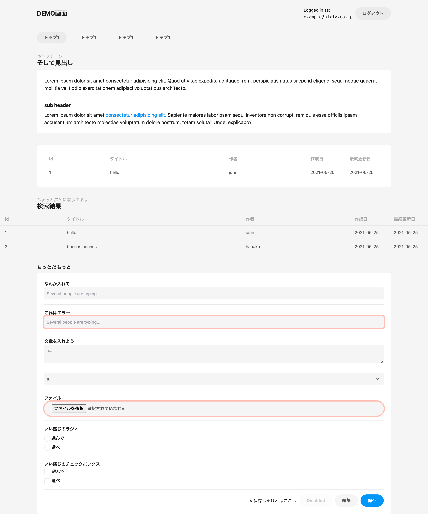
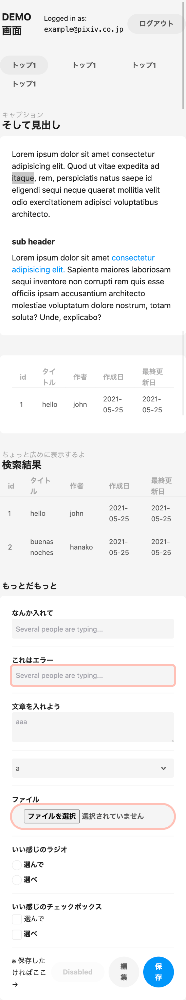

# charcoal-classless

[pixiv/charcoal](https://github.com/pixiv/charcoal) をベースにした classless CSS framework です。

## 使い方

```html
<link rel="stylesheet" href="https://fsubal.github.io/charcoal-classless/index.min.css">
```

## 様子

デモコードは `/example` 以下参照。デモページの起動には Parcel を使います

```
yarn parcel example/index.html
```

このページは一切 CSS のクラスを当てていません。

| PC                      | mobile                 |
| ----------------------- | ---------------------- |
|  |  |

## サポートしてる要素

### `h1` ~ `h6`

いい感じの見出しを描画します。

h1 と h2 にはサブ見出しを `span` または `small` で中に入れることが出来ます

### `header`

適当に中央寄せした flexbox を描画します。

1 個めの要素が `flex: 1 0` になるため、2 個め以降の要素が右側に寄せられます。

### `section` `article`

中央寄せの白い角丸四角形を描画します

### `footer`

`section` または `article` の中に置いた場合、右寄せになります。

送信ボタンを右寄せしたいとかそういう用途に使ってください。

### `nav` > `ul` > `li`

pixiv の検索画面などに出てくる角丸のフィルターっぽい見た目になります

### `button`

デフォルトではグレー、`<button type="submit">` の場合のみ pixiv のブランドカラーのボタンになります。

### `a`

文字の場合、pixiv のブランドカラーになります。`role="button"` をつけると黒のボタンになります。

### `label`

デフォルトではフォームのフィールド見出しとみなされ、太字になります。

```html
<label>
  太字になる（見出し）
  <input type="text" />
</label>
```

チェックボックスなどのラベルとして使うので太字にしたくない、という場合は `input` 要素を囲わないでください。
隣に書いて `for` 属性で関連付けてください。

```html
<input type="checkbox" id="check1" /> <label for="check1">細字になる</label>
```

### `input[type="radio"]`

pixiv っぽいラジオボタンになります。

`aria-invalid` 属性をつけるとエラー時の見た目になります。

### `input[type="checkbox"]`

pixiv っぽいチェックボックスになります。

`aria-invalid` 属性をつけるとエラー時の見た目になります。

### `input[type=text,number,search,email,date,datetime,datetime-local]`

pixiv っぽいテキストボックスになります。

`aria-invalid` 属性をつけるとエラー時の見た目になります。

### `textarea`

pixiv っぽい複数行テキストエリアになります。

`aria-invalid` 属性をつけるとエラー時の見た目になります。

### `select`

pixiv っぽいセレクトボックスになります。`<select multiple>` はサポートしていません。

`aria-invalid` 属性をつけるとエラー時の見た目になります。

### `table`

pixiv っぽい表になります。

表は広い幅で描画したいはずなので、`<section>` 外で使っても上手くいくようにしてます。

## 真面目にサポートしてない

### `input[type=file]`

ちょっとボタンっぽい見た目になりますが中身はほぼほぼブラウザのデフォルトです
